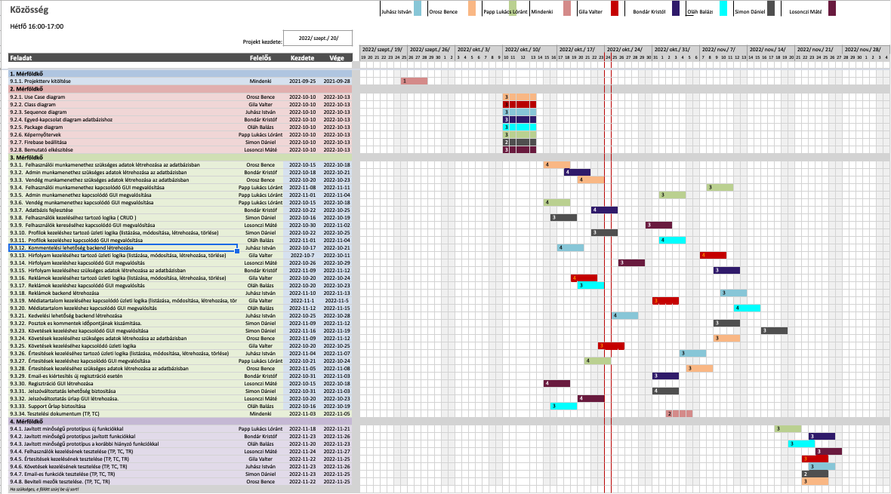

# Közösség Projektterv 2022

## 1. Összefoglaló 

A Közösségi weboldal lényege, hogy az emberek a világ bármely pontjáról tudjanak kommunikálni és kapcsolatba lépni egymással. A felhasználók fényképeket és videókat tölthetnek fel, majd ezeket megoszthatják egymással. A felhasználók tudják követni egymást, kinyilváníthatják tetszésüket, illetve kommentálhatják a feltöltött tartalmakat. Ezekről értesítést is kapnak, hogy ne maradjanak le a legfontosabb dolgokról. 

```
Ide írd le tömören (4-6 mondatban), hogy miről szól a projekt, amit a gyakorlatvezetőtől kaptatok. 
Írd le, hogy mik a fő célok, miért van a weboldalra szükség. 
A dokumentumban a pirossal illetve a blokkokkal kiemelt szövegeknek két jelentése van: 
(a) minta/sablon szöveg, amit le kell cserélni, pl. gyakorlatvezető neve; 
(b) segítő/magyarázó szöveg. 
Az átadott dokumentumban nem szerepelhetnek se pirossal kiemelt, se blokkban szereplő részek! A
feketével írt részek törlése tilos, azok közösek.
```

## 2. Verziók

| Verzió | Szerző(k)                | Dátum        | Státusz         | Megjegyzés                                                    |
|--------|--------------------------|--------------|-----------------|---------------------------------------------------------------|
|  0.1   |  Juhász István           | 2021-10-09   |  Tervezet       | Legelső verzió                                                |
|  0.2   |  Mindenki                | 2021-10-09   |  Előterjesztés  | Projektterv                                                   |
|  0.3   |  Mindenki                | 2021-10-17   |  Előterjesztés  | Projektterv módositott                                        |

Státusz osztályozás:
 - Tervezet: befejezetlen dokumentum, a mérföldkő leadása előtti napokban
 - Előterjesztés: a projekt menedzser bírálatával, a mérföldkő határidejekor
 - Elfogadott: a megrendelő által elfogadva, a prezentáció bemutatásakor

```
A leadott projekttervet véglegesnek kell tekinteni. 
Mindazonáltal indokolt esetben ettől el lehet térni, amennyiben a gyakorlatvezető engedélyezi.
A fő változtatásokat itt kell vezetni a projekt teljes ideje alatt (jelenlegi példánkban most lett vége a 2. mérföldkőnek). 
Általánosságban elmondható, hogy az első 2 mérföldkő során gyakoribb a változtatás, így legalább 
3 fő verziót érdemes megjelölni (Tervezet-Előterjesztés-Elfogadott).
A verzió számozásának következetesnek kell lennie. A szerzőknél azoknak a nevét kell felsorolni, akik hozzájárultak a fő verzióhoz,
azaz nem feltétlen mindenki, aki módosította a dokumentumot pl. egy elírás javításával. 
```

## 3. A projekt bemutatása

Ez a projektterv a Közösség projektet mutatja be, mely 2022-09-05-től 2021-12-05-ig tart. A projekt célja, hogy megfelelő felületet biztosítson az újonnan megalakuló közösségi média felületért. Mindezért egy egyszerűen használható, átlátható és hatékonyan működő webalkalmazás fog felelni. A projekten nyolc fő fejlesztő fog dolgozni, az elvégzett feladatokat pedig négy alkalommal fogjuk prezentálni a megrendelőnek. 

```
A megvalósítás további általános leírása, pl. mennyi főből áll a csapat, mennyi átadandó lesz a megrendelőnek a félév során, 
szintén 4-6 mondattal leírva.
```

### 3.1. Rendszerspecifikáció

A közösségi felület célja, egy olyan felület létrehozása, ahol az emberek képesek egymással kapcsolatba lépni az interneten keresztül. A felhasználók szeretnének videókat és képeket megosztani magukról, az életükről és a mindennapjaikról. A fogyasztók képesek lesznek majd megkeresni, követni a másikat, véleményüket kinyilvánítani és kommentelni egymás tartalma alá. Ezekről a funkciókról azonnali értesítéseket is kapni fognak.

```
Ide írd le részletesen, hogy mit fog tudni a rendszer (4-6 mondatban), amit a projekt keretében kerül megvalósításra. 
Mik a megrendelő és a felhasználók igényei? Miért van szükség a projektre?
```

### 3.2. Funkcionális követelmények

 - Felhasználói munkamenet megvalósítása több jogosultsági szinttel (admin, bejelentkezett felhasználó, vendég felhasználó):
	- Vendég (Guest) felhasználó:
		+ Nagyrészt korlátozott tulajdonságokkal rendelkezik, regisztrációval léphet tovább, addig csak böngészni, ill. regisztrálni és bejelentkezni tud.
 	- Bejelentkezett (ill. regisztrált) felhasználó:
		+ Első alkalomnál regisztráció, utána loginnal elérhető jogszint. Ő az aki már tud tevékenykedni a saját oldalán, posztolhat, kommentelhet, és likeolhat.
	- Admin:
		+ Minden jogosultsággal rendelkezik (pl. posztok törlése, kommentek moderálása stb...), moderátorok ill. developerek rendelkeznek vele.
 - Felhasználók kezelése (CRUD):
	- Az oldal rendelkezik egy bejelentkező ill. egy regisztrációs felülettel, ahol tudnak a régi/új felhasználók bejelentkezni régi fiókjaikba, ill. létrehozni újat. 
	- Már létrehozott fiókoknál lehetőség van a bejelentkezési adatok módosítására (jellemzően e-mail cím/jelszó).
	- Lehetőség van fiók(ok) törlésére is, az adminisztrátor vagy saját döntés alapján.
 - Regisztráció/bejelentkezés folyamata (CRUD):
	- Regisztrálni bármelyik személy tud jogtól független. Kell megadni egy szabad e-mail címet, és egy tetszőleges jelszót 2x. Helyes form kitöltés után az e-mail címre, amivel lehet bejelentkezni.
	- Bejelentkezni e-mail cím és jelszó párosítással lehetséges, sikeres regisztráció után.
 - Képek és videók feltöltése (CRUD):
	- Minimum követelmény: Legyen egy regisztrált fiók és legyen bejelentkezve az adott személy.
	- Lehetőség van posztolásra, kép ill. videó feltöltésére. Maximális méret egyelőre nincs.
	- Ha esetleg később már nem szeretnénk, hogy lássa más, lehet letörölni is őket.
 - Felhasználók keresése (CRUD):
	- Lehetőség van felhasználók/oldalak keresésére, ehhez is minimum követelmény a bejelentkezett fiók.
	- Keresés e-mail cím ill. tel. szám alapján lesz lehetséges.
 - Idővonal megtekintése (CRUD):
	- Szintén regisztrált fiókkal lehetséges belépés után, az ismerősök aktivitását tudja megtekinteni, ill. interaktálni vele.
 - Értesítés kommentekről, like-okról és követésekről:
	- Ha szeretnénk, hogy naprakészek legyünk, egy csengő ikon megnyomása után már tudni fogunk róla, hogy mi történik az adott poszt alatt.
	- Regisztrált fiókkal, belépés után és barátlistán szereplő személy esetén lehetséges.
 - Kommentelés, követés és like-olás funckió:
	- A social media platformok nagy része a kommentelés/követés és az ún. like-olás. Így tudunk interaktálni más személyekkel az oldalon.
 - Regisztrált felhasználóknak saját profil:
	- Lesz külön oldala az adott felhasználónak, ahol megjelenik a saját profilképe, adatai, képei. Saját követéseit és követőit fogja látni. Profilképet lehet változtatni.
 - Poszt készítése:
	- Regisztrált és belépett felhasználók tudnak posztot csinálni, ami tartalmaz egy képet és leírást a poszthoz kapcsolódóan. Más felhasználók tudnak reagálni és kommentelni a poszt alatt.
 - Posztok és kommentek pontos időpontja:
	- Minden poszt/kommentnek lesz egy ún. timestampje, hogy tudjuk mikor történt az adott interakció a poszt alatt.
 
```
Ide kerülnek a rendszerrel szemben támasztott funkcionális igények: azaz amit a rendszernek tudnia kell.
```

### 3.3. Nem funkcionális követelmények

 - A kliens oldal platform- és böngészőfüggetlen legyen
 - Reszponzív megjelenés
 - Szenzitív adatokat biztonságosan tároljuk
 - A legfrissebb technológiákat használja a rendszer
 - Egyszerű kezelőfelület

```
A rendszer nem funkcionális követelményei, pl.: milyen környezetben fusson, milyen teljesítményt kell produkálnia, 
milyen megjelenéssel kell rendelkeznie.
```

## 4. Költség- és erőforrás-szükségletek

Az erőforrásigényünk összesen kb. 20 személynap/fő.

A rendelkezésünkre áll összesen 8 * 70 = 560 pont.

```
Becsült sarokszámok, a rendelkezésre álló erőforrás fejenként általában 17-25 személynap, 
a pontok száma = fejenként a projektre kapható maxpont * tagok száma.
```

## 5. Szervezeti felépítés és felelősségmegosztás
A projekt megrendelője Dr. Pflanzner Tamás. A Közösség projektet a projektcsapat fogja végrehajtani, amely jelenleg nyolc fejlesztőből áll. A csapatban leginkább kezdő és haladó fejlesztők dolgoznak.
 - Juhász István (<1 év tapasztalat)
 - Losonczi Máté (<1 év tapasztalat)
 - Gila Valter (<1 év tapasztalat)
 - Orosz Bence (<1 év tapasztalat)
 - Bondár Kristóf (<1 év tapasztalat)
 - Simon Dániel (<1 év tapasztalat)
 - Oláh Balázs (<1 év tapasztalat)
 - Papp Lukács (<1 év tapasztalat)

### 5.1 Projektcsapat
A projekt a következő emberekből áll:

|                                                                                                                   | Név             | E-mail cím (stud-os)       |
|-------------------------------------------------------------------------------------------------------------------|-----------------|----------------------------|
| Megrendelő                                                                                                        | Dr. Pflanzner Tamás | tampfla@inf.u-szeged.hu |
| Felelősségek: Projekt menedzser, A rendszer működési logikája, Backend, Prezentációk                              | Juhász István       | h046416@stud.u-szeged.hu |
| Felelősségek: Backend                                                                                             | Gila Valter         | h045200@stud.u-szeged.hu |
| Felelősségek: Adatbázis                                                                                           | Orosz Bence         | h049967@stud.u-szeged.hu |
| Felelősségek: Adatbázis                                                                                           | Bondár Kristóf      | h043327@stud.u-szeged.hu |
| Felelősségek: Backend                                                                                             | Simon Dániel        | h051356@stud.u-szeged.hu |
| Felelősségek: Frontend                                                                                            | Losonczi Máté       | h048281@stud.u-szeged.hu |
| Felelősségek: Frontend                                                                                            | Oláh Balázs         | h049912@stud.u-szeged.hu |
| Felelősségek: Frontend                                                                                            | Papp Lukács         | h050203@stud.u-szeged.hu |
```
Nem csak az adott egység felelősének feladata az adott részegység elkészítése, pl. a mérföldkövekhez tartozó prezentációt 
mindenki szerkesztheti, de elvárható, hogy a prezentációért felelős tag adja elő. 
```

## 6. A munka feltételei

### 6.1. Munkakörnyezet
A projekt a következő munkaállomásokat fogja használni a munka során:
 - Munkaállomások: 
 - Macbook Air M1
 - Acer Aspire 5 
 - Lenovo Ideapad 3
 - Dell Insprion 15 7000 Gaming
 - LG Gram 14Z990
 - Lenovo Thinkpad X250
 - Asztali számítógép Windows 10 Pro operációs rendszerrel

A projekt a következő technológiákat/szoftvereket fogja használni a munka során: 
 - Firebase platformszolgáltatás 
 - Firebase által biztosított NoSQL adatbázisszerver
 - Javascript (backend)
 - Angular (frontend)
 - Visual Studio Code
 - IntelliJ IDEA
 - Git verziókövető (GitLab)

```
Milyen gépet használnak a projekttagok, milyen OS-t használnak, milyen szoftverkörnyezetben, stb.
```

### 6.2. Rizikómenedzsment

| Kockázat                                    | Leírás                                                                                                                                                                                     | Valószínűség | Hatás  |
|---------------------------------------------|--------------------------------------------------------------------------------------------------------------------------------------------------------------------------------------------|--------------|--------|
| Betegség                                  | Súlyosságtól függően hátráltatja vagy bizonyos esetekben teljes mértékben korlátozza a munkavégzőt, így az egész projektre kihatással van. Megoldás: a feladatok átcsoportosítása            | nagy         | erős |
| Kommunikációs fennakadás a csapattagokkal | A csapattagok között nem elégséges az információ áramlás, nem pontosan, esetleg késve vagy nem egyértelműen tájékoztatjuk egymást. Megoldás: még gyakoribb megbeszélések és ellenőrzések     | kis          | erős |
| Hardver hiba | Valamelyik tagnak hardvare problémája van ezért egy ideig nem tudja folytatni a munkát. Megoldás: a feladatok átcsoportosítása                                                                                            | kis          | erős |

```
A rizikótényezők bemutatása, amely hátráltathatja a projekt befejezését. Minden rizikót érdemes megemlíteni, részletezve, hogy mit jelent, 
milyen valószínűséggel következhet be (kis, közepes és nagy) és mekkora a várható hatása (gyenge, közepes és erős) 
és hogy milyen tervvel készültök, amennyiben egy ilyen esemény bekövetkezik. Pl.: betegség, szoftver-hardver probléma, tag kiesése, stb. 
```

## 7. Jelentések

### 7.1. Munka menedzsment
A munkát Juhász István koordinálja. Fő feladata, hogy folyamatosan egyeztessen a csapattagokkal az előrehaladásról és a fellépő problémákról, esetlegesen a megoldásban is segítséget nyújhat a projekt csúszásának elkerülése végett. További feladata a heti szinten tartandó csoportgyűlések időpontjának és helyszínének leszervezése, erről Discordon tájékoztatja a projektcsapatot.

```
Írd le, hogy ki menedzseli a munkát (tipikusan a projekt menedzser), mik a feladatai, és azokat hogyan hajtja végre.
```

### 7.2. Csoportgyűlések

A projekt hetente ülésezik, hogy megvitassák az azt megelőző hét problémáit, illetve hogy megbeszéljék a következő hét feladatait.

1. megbeszélés:
 - Időpont: 2022.09.05.
 - Hely: Discord
 - Résztvevők: Juhász István, Orosz Bence, Papp Lukács, Gila Valter, Losonczi Máté, Simon Dániel, Oláh Balázs, Bondár Kristóf
 - Érintett témák: Ismerkedés, projekttémák megnézése

2. megbeszélés:
 - Időpont: 2022.09.12.
 - Hely: Discord
 - Résztvevők: Juhász István, Orosz Bence, Gila Valter, Losonczi Máté, Simon Dániel, Oláh Balázs, Bondár Kristóf
 - Érintett témák: A projekttéma kiválasztása, projektvezető megválasztása.

3. Megbeszélés:
 - Időpont: 2022.09.19.
 - Hely: Discord.
 - Résztvevők: Orosz Bence, Papp Lukács, Gila Valter, Losonczi Máté, Simon Dániel, Oláh Balázs, Bondár Kristóf
 - Érintett témák: Funkcionális és nem funkcionális követelmények megbeszélése.

4. Megbeszélés:
 - Időpont: 2022.09.26.
 - Hely: Discord.
 - Résztvevők: Juhász István, Orosz Bence, Papp Lukács, Gila Valter, Simon Dániel, Oláh Balázs, Bondár Kristóf
 - Érintett témák:  Használt technológiák átbeszélése, szerepek felosztása.
 
5. Megbeszélés:
 - Időpont: 2022.10.09.
 - Hely: Discord.
 - Résztvevők: Juhász István, Papp Lukács, Gila Valter, Simon Dániel, Oláh Balázs, Bondár Kristóf, Losonczi Máté
 - Érintett témák:  Használt technológiák átbeszélése, szerepek felosztása.

6. Megbeszélés:
 - Időpont: 2022.11.13.
 - Hely: Discord.
 - Résztvevők: Juhász István, Papp Lukács, Gila Valter, Simon Dániel, Oláh Balázs(írásban), Bondár Kristóf, Losonczi Máté
 - Érintett témák:  Végső simítások projekt bemutatása előtt, általános megbeszélés.

```
A memókat ebben a dokumentumban kell vezetni a teljes projekt során, amely tartalmazza a következőket: 
jelenlévők listája, megbeszélés helye és ideje, megbeszélt tevékenységek, felmerült kérdések és igények. 
	Lényege, hogy betekintést kapjunk hogyan szerveződnek, zajlanak a csoportgyűlések.
```

### 7.3. Minőségbiztosítás

Az elkészült terveket a terveken nem dolgozó csapattársak közül átnézik, hogy megfelel-e a specifikációnak és az egyes diagramtípusok összhangban vannak-e egymással. A meglévő rendszerünk helyes működését a prototípusok bemutatása előtt a tesztelési dokumentumban leírtak végrehajtása alapján ellenőrizzük és összevetjük a specifikációval, hogy az elvárt eredményt kapjuk-e. További tesztelési lehetőségek: unit tesztek írása az egyes modulokhoz vagy a kód közös átnézése (code review) egy, a vizsgált modul programozásában nem résztvevő csapattaggal. Szoftverünk minőségét a végső leadás előtt javítani kell a rendszerünkre lefuttatott kódelemzés során kapott metrikaértékek és szabálysértések figyelembevételével.
Az alábbi lehetőségek vannak a szoftver megfelelő minőségének biztosítására:
- Specifikáció és tervek átnézése (kötelező)
- Teszttervek végrehajtása (kötelező)
- Unit tesztek írása (választható)
- Kód átnézése (választható)

### 7.4. Átadás, eredmények elfogadása

A projekt eredményeit Dr. Pflanzner Tamás fogja elfogadni. A projektterven változásokat csak  Dr. Pflanzner Tamás írásos kérés esetén Dr. Pflanzner Tamás engedélyével lehet tenni. A projekt eredményesnek bizonyul, ha specifikáció helyes és határidőn belül készül el. Az esetleges késések pontlevonást eredményeznek.
Az elfogadás feltételeire és beadás formájára vonatkozó részletes leírás a következő honlapon olvasható: https://okt.sed.hu/rf1/

### 7.5. Státuszjelentés

Minden leadásnál a projektmenedzser jelentést tesz a projekt haladásáról, és ha szükséges változásokat indítványoz a projektterven. Ezen kívül a megrendelő felszólítására a menedzser 3 munkanapon belül köteles leadni a jelentést. A gyakorlatvezetővel folytatott csapatmegbeszéléseken a megadott sablon alapján emlékeztetőt készít a csapat, amit a következő megbeszélésen áttekintenek és felmérik az eredményeket és teendőket. Továbbá gazdálkodnak az erőforrásokkal és szükség esetén a megrendelővel egyeztetnek a projektterv módosításáról.

## 8. A munka tartalma

### 8.1. Tervezett szoftverfolyamat modell és architektúra

A szoftver fejlesztése során az agilis fejlesztési modellt alkalmazzuk. A fejlesztés során nagy hangsúlyt fektetünk a folyamatos kommunikcióra. A fejlesztés során a szoftver specifikációi rugalmasan vátozhatnak, és ezzel a módszertannal tudunk a leggyorsabban alkalmazkodni az új elvárásokhoz.

A szoftver MVC alapú REST webszolgáltatásként működik. A szerver és a kliens függetlenek, csupán API végpontok segítségével kommunikálnak.

```
Milyen szoftverfolyamat modellt követve állítja elő a csapat a specifikációnak megfelelő prototípusokat? Miért ezt választja? 
A csapat milyen architektúrát választ a projekt megvalósításához? Milyen rétegek (logikai, adat, GUI) lesznek?`
```

### 8.2. Átadandók és határidők
A főbb átadandók és határidők a projekt időtartama alatt a következők:


| Szállítandó |                 Neve                |   Határideje  |
|:-----------:|:-----------------------------------:|:-------------:|
|      D1     |       Projektterv és útmutató       |  2021-10-10   |
|    P1+D2    | UML, DB, képernyőtervek és bemutató |  2021-10-24   |
|    P1+D3    |      Prototípus I. és bemutató      |  2021-11-14   |
|    P2+D4    |      Prototípus II. és bemutató     |  2021-11-28   |

```
D - dokumentáció, P - prototípus
```

## 9. Feladatlista

A következőkben a tervezett feladatok részletes összefoglalása található.

```
Alapvetően egy feladatnak 1 felelőse lehet, de kivételt képez pl. a 9.1.1. részfeladat.`
```

### 9.1. Projektterv (1. mérföldkő)

Ennek a feladatnak az a célja, hogy megvalósításhoz szükséges lépéseket, az ütemzést és a felelősöket meghatározzuk.

Részfeladatai a következők:

#### 9.1.1. Projektterv kitöltése

Felelős: Mindenki

Tartam:  4 nap

Erőforrásigény:  1 személynap/fő


```
A mérföldkőhöz tartozó feladatok bemutatása PPT keretében, pl. téma, tervezett funkciók, tagok, Gantt diagram.`
```

### 9.2. UML és adatbázis tervek (2. mérföldkő)

Ennek a feladatnak az a célja, hogy a rendszerarchitektúrát, az adatbázist és webalkalmazás kinézetét megtervezzük.

Részfeladatai a következők:

#### 9.2.1. Use Case diagram

Felelős: Orosz Bence

Tartam:  5 nap

Erőforrásigény:  3 személynap

#### 9.2.2. Class diagram

Felelős: Gila Valter

Tartam:  5 nap

Erőforrásigény:  3 személynap

#### 9.2.3. Sequence diagram

Felelős: Juhász István

Tartam:  5 nap

Erőforrásigény:  3 személynap

#### 9.2.4. Egyed-kapcsolat diagram adatbázishoz

Felelős: Bodnár Kristóf

Tartam:  5 nap

Erőforrásigény:  3 személynap

#### 9.2.5. Package diagram

Felelős: Oláh Balázs

Tartam:  5 nap

Erőforrásigény:  3 személynap

#### 9.2.6. Képernyőtervek

Felelős: Papp Lukács Lóránt

Tartam:  5 nap

Erőforrásigény:  3 személynap

#### 9.2.7. Firebase beállítása

Felelős: Simon Dániel

Tartam:  5 nap

Erőforrásigény:  3 személynap

#### 9.2.8. Bemutató elkészítése

Felelős: Losonczi Máté

Tartam:  5 nap

Erőforrásigény:  3 személynap

```
A mérföldkőhöz tartozó feladatok bemutatása PPT keretében (elkészült diagramok és képernyőtervek)`
```

### 9.3. Prototípus I. (3. mérföldkő)

Ennek a feladatnak az a célja, hogy egy működő prototípust hozzunk létre, ahol a vállalt funkcionális követelmények nagy része már prezentálható állapotban van.

Részfeladatai a következők:

#### 9.3.1.  Felhasználói munkamenethez szükséges adatok létrehozása az adatbázisban

Felelős: Orosz Bence

Tartam:  4 nap

Erőforrásigény:  4 személynap

#### 9.3.2.  Admin munkamenethez szükséges adatok létrehozása az adatbázisban

Felelős: Bodnár Kristóf

Tartam:  3 nap

Erőforrásigény:  3 személynap

#### 9.3.3.  Vendég munkamenethez szükséges adatok létrehozása az adatbázisban

Felelős: Orosz Bence

Tartam:  4 nap

Erőforrásigény:  4 személynap

#### 9.3.4.  Felhasználói munkamenethez kapcsolódó GUI megvalósítása

Felelős: Papp Lukács Lóránt

Tartam:  4 nap

Erőforrásigény:  3 személynap

#### 9.3.5.  Admin munkamenethez kapcsolódó GUI megvalósítása

Felelős: Papp Lukács Lóránt

Tartam:  4 nap

Erőforrásigény:  3 személynap

#### 9.3.6.  Vendég munkamenethez kapcsolódó GUI megvalósítása

Felelős: Papp Lukács Lóránt

Tartam:  4 nap

Erőforrásigény:  4 személynap

#### 9.3.7.  Adatbázis fejlesztése

Felelős: Bodnár Kristóf

Tartam:  4 nap

Erőforrásigény:  4 személynap

#### 9.3.8.  Felhasználók kezeléséhez tartozó logika ( CRUD )

Felelős: Simon Dániel

Tartam:  4 nap

Erőforrásigény:  3 személynap

#### 9.3.9.  Bejelentkezéshez tartozó GUI megvalósítása

Felelős: Losonczi Máté

Tartam:  4 nap

Erőforrásigény:  3 személynap

#### 9.3.10.  Keresőmotor létrehozása

Felelős: Simon Dániel

Tartam:  4 nap

Erőforrásigény:  3 személynap

#### 9.3.11.  Profilok kezeléshez kapcsolódó GUI megvalósítása

Felelős: Oláh Balázs

Tartam:  4 nap

Erőforrásigény:  4 személynap

#### 9.3.12.  Kommentelési lehetőség backend létrehozása

Felelős: Juhász István

Tartam:  4 nap

Erőforrásigény:  4 személynap

#### 9.3.13.  Hirfolyam kezeléséhez tartozó üzleti logika (listázása, módosítása, létrehozása, törlése)

Felelős: Gila Valter

Tartam:  4 nap

Erőforrásigény:  4 személynap

#### 9.3.14.   Lájkolások számánának kimutatásához tartozó GUI  megvalósítás

Felelős: Losonczi Máté

Tartam:  4 nap

Erőforrásigény:  3 személynap

#### 9.3.15.  Hirfolyam kezeléséhez szükséges adatok létrehozása az adatbázisban

Felelős: Bodnár Kristóf

Tartam:  3 nap

Erőforrásigény:  3 személynap

#### 9.3.16.  Reklámok kezeléséhez tartozó üzleti logika (listázása, módosítása, létrehozása, törlése)

Felelős: Gila Valter

Tartam:  4 nap

Erőforrásigény:  4 személynap

#### 9.3.17.  Reklámok kezeléshez kapcsolódó GUI megvalósítás

Felelős: Oláh Balázs

Tartam:  4 nap

Erőforrásigény:  3 személynap

#### 9.3.18.  Reklámok backend létrehozása

Felelős: Juhász István

Tartam:  4 nap

Erőforrásigény:  3 személynap

#### 9.3.19.  Médiatartalom kezeléséhez kapcsolódó üzleti logika (listázása, módosítása, létrehozása, törlése)

Felelős: Gila Valter

Tartam:  4 nap

Erőforrásigény:  3 személynap

#### 9.3.20.  Médiatartalom kezeléshez kapcsolódó GUI megvalósítás

Felelős: Oláh Balázs

Tartam:  4 nap

Erőforrásigény:  4 személynap

#### 9.3.21.  Kedvelési lehetőség backend létrehozása

Felelős: Juhász István

Tartam:  4 nap

Erőforrásigény:  4 személynap

#### 9.3.22.  Posztok es kommentek időpontjának kiszámitása

Felelős: Simon Dániel

Tartam:  4 nap

Erőforrásigény:  3 személynap

#### 9.3.23.  Követések kezeléshez kapcsolódó GUI megvalósítása

Felelős: Simon Dániel

Tartam:  4 nap

Erőforrásigény:  3 személynap

#### 9.3.24.  Követések kezeléséhez szükséges adatok létrehozása az adatbázisban

Felelős: Orosz Bence

Tartam:  4 nap

Erőforrásigény:  3 személynap

#### 9.3.25.  Követések kezeléséhez kapcsolódó üzleti logika

Felelős: Gila Valter

Tartam:  4 nap

Erőforrásigény:  3 személynap

#### 9.3.26.  Értesitések kezeléséhez tartozó üzleti logika (listázása, módosítása, létrehozása, törlése)

Felelős: Juhász István

Tartam:  4 nap

Erőforrásigény:  3 személynap

#### 9.3.27.  Értesitések kezeléshez kapcsolódó GUI megvalósítása

Felelős: Papp Lukács Lóránt

Tartam:  4 nap

Erőforrásigény:  4 személynap

#### 9.3.28.  Értesitések kezeléséhez szükséges adatok létrehozása az adatbázisban

Felelős: Orosz Bence

Tartam:  4 nap

Erőforrásigény:  3 személynap

#### 9.3.29.  Email-es kiértesítés új regisztráció esetén

Felelős: Bodnár Kristóf

Tartam:  3 nap

Erőforrásigény:  3 személynap

#### 9.3.30.  Regisztráció GUI létrehozása

Felelős: Losonczi Máté

Tartam:  4 nap

Erőforrásigény:  4 személynap

#### 9.3.31.  Jelszóváltoztatás lehetőség biztositása

Felelős: Simon Dániel

Tartam:  4 nap

Erőforrásigény:  2 személynap

#### 9.3.32.  Jelszóváltoztatás ürlap GUI létrehozása

Felelős: Losonczi Máté

Tartam:  4 nap

Erőforrásigény:  4 személynap

#### 9.3.33.  Support űrlap biztosítása

Felelős: Oláh Balázs

Tartam:  4 nap

Erőforrásigény:  3 személynap

#### 9.3.34. Tesztelési dokumentum (TP, TC)

Felelős: Mindenki

Tartam:  3 nap

Erőforrásigény:  2 személynap/fő

#### 9.3.35. Profil frontend és backend összekötése

Felelős: Simon Dániel

Tartam:  2 nap

Erőforrásigény:  2 személynap/fő

#### 9.3.36. Feed frontend és backend összekötése

Felelős: Simon Dániel

Tartam:  2 nap

Erőforrásigény:  2 személynap/fő

#### 9.3.37 E-mail sablon készítése, és felhasználók korlátozása backendben

Felelős: Bondár Kristóf

Tartam:  2 nap

Erőforrásigény:  2 személynap/fő


```
A feladatokat a 3.2-es pont figyelembevételével érdemes meghatározni és lehető legrészletesebben definiálni a feladatokat és a felelőseit. 
A bemutató során a prototípus aktuális állását kell prezentálni.
```

### 9.4. Prototípus II. (4. mérföldkő)

Ennek a feladatnak az a célja, hogy az előző mérföldkő hiányzó funkcióit pótoljuk, illetve a hibásan működő funkciókat és az esetlegesen felmerülő új funkciókat megvalósítsuk. Továbbá az alkalmazás alapos tesztelése is a mérföldkőben történik.

Részfeladatai a következők:

#### 9.4.1. Javított minőségű prototípus új funkciókkal

Felelős: Papp Lukács Lóránt

Tartam:  4 nap

Erőforrásigény:  3 személynap

#### 9.4.2. Javított minőségű prototípus javított funkciókkal

Felelős: Bodnár Kristóf

Tartam:  4 nap

Erőforrásigény:  3 személynap

#### 9.4.3. Javított minőségű prototípus a korábbi hiányzó funkciókkal

Felelős: Oláh Balázs

Tartam:  4 nap

Erőforrásigény:  3 személynap

#### 9.4.4. Felhasználók kezelésének tesztelése (TP, TC, TR)

Felelős: Losonczi Máté

Tartam:  4 nap

Erőforrásigény:  3 személynap

#### 9.4.5. Értesitések kezelésének tesztelése (TP, TC, TR)

Felelős: Gila Valter

Tartam:  4 nap

Erőforrásigény:  3 személynap

#### 9.4.6. Követések kezelésének tesztelése (TP, TC, TR)

Felelős: Juhász István

Tartam:  4 nap

Erőforrásigény:  3 személynap

#### 9.4.7. Email-es funkciók tesztelése (TP, TC, TR)

Felelős: Simon Dániel

Tartam:  4 nap

Erőforrásigény:  3 személynap

#### 9.4.8. Beviteli mezők tesztelése. (TP, TC, TR)

Felelős: Orosz Bence

Tartam:  4 nap

Erőforrásigény:  3 személynap

```
Működő végleges program, a frissített tesztelési dokumentációval. A 3. mérföldkőhöz képest funkiconálisan többet kell tudnia az oldalnak.

```
## 10. Részletes időbeosztás



```
Ide kell berakni a Gantt diagramot, amely a 9. fejezetben található részfeladatokat tartalmazza felelős/tartam bontásban.
```

## 11. Projekt költségvetés

```
Az egyes leadások alkalmával rögzített erőforrásigényt, az elvállalt feladatok számát 
és az adott mérföldkőben végzett munkáért szerezhető pontszámot kell beírni minden emberre külön-külön.
```

### 11.1. Részletes erőforrásigény (személynap)


|                     Név                    | 1. leadás - Projektterv | 2. leadás - UML és adatbázis | 3. leadás - Prototípus I. | 4. leadás - Prototípus II. | Összesen |
|:------------------------------------------:|:----------------------:|:--------------------------:|:-----------------------:|:------------------------:|:-----------:|
|                     Bondár Kristóf       |           1          |             3            |           16          |            3           |    23     |
|                     Juhász István        |           2          |             3            |           10          |            6           |    20     |
|                     Gila Valter          |           1          |             3            |           16          |            3           |    23     |
|                     Orosz Bence          |           1          |             3            |           16          |            3           |    23     |
|                     Oláh Balázs          |           1          |             3            |           16          |            3           |    23     |
|                     Papp Lukács Lóránt   |           2          |             3            |           10          |            5           |    20     |
|                     Simon Dániel         |           1          |             3            |           16          |            3           |    23     |
|                     Losonczi Máté        |           1          |             3            |           16          |            3           |    23     |


### 11.2. Részletes feladatszámok

|                     Név                    | 1. leadás - Projektterv | 2. leadás - UML és adatbázis | 3. leadás - Prototípus I. | 4. leadás - Prototípus II. | Összesen |
|:------------------------------------------:|:----------------------:|:--------------------------:|:-----------------------:|:------------------------:|:---------:|
|                     Bondár Kristóf       |           1          |             1            |           5          |            1           |    8     |
|                     Juhász István        |           1          |             1            |           5          |            1           |    8     |
|                     Gila Valter          |           1          |             1            |           5          |            1           |    8     |
|                     Orosz Bence          |           1          |             1            |           5          |            1           |    8     |
|                     Oláh Balázs          |           1          |             1            |           5          |            1           |    8     |
|                     Papp Lukács Lóránt   |           1          |             1            |           5          |            1           |    8     |
|                     Simon Dániel         |           1          |             1            |           8          |            1           |    11    |
|                     Losonczi Máté        |           1          |             1            |           5          |            1           |    8     |

### 11.3. Részletes költségvetés

|                     Név                       | 1. leadás - Projektterv | 2. leadás - UML és adatbázis | 3. leadás - Prototípus I. | 4. leadás - Prototípus II. | Összesen |
|:---------------------------------------------:|:----------------------:|:--------------------------:|:-----------------------:|:------------------------:|:---------:|
|        Maximálisan választható pontszám %-ban |         10% (7)        |            30% (21)        |          50% (35)       |          30% (21)        | 100% (70) |
|                     Bondár Kristóf          |           10%        |             30%          |           50%         |            30%         |    100% |
|                     Juhász István           |           10%        |             30%          |           50%         |            30%         |    100% |
|                     Gila Valter             |           10%        |             30%          |           50%         |            30%         |    100% |
|                     Orosz Bence             |           10%        |             30%          |           50%         |            30%         |    100% |
|                     Oláh Balázs             |           10%        |             30%          |           50%         |            30%         |    100% |
|                     Papp Lukács Lóránt      |           10%        |             30%          |           50%         |            30%         |    100% |
|                     Simon Dániel            |           10%        |             30%          |           50%         |            30%         |    100% |
|                     Losonczi Máté           |           10%        |             30%          |           50%         |            30%         |    100% |

Szeged, 2022-10-09.
